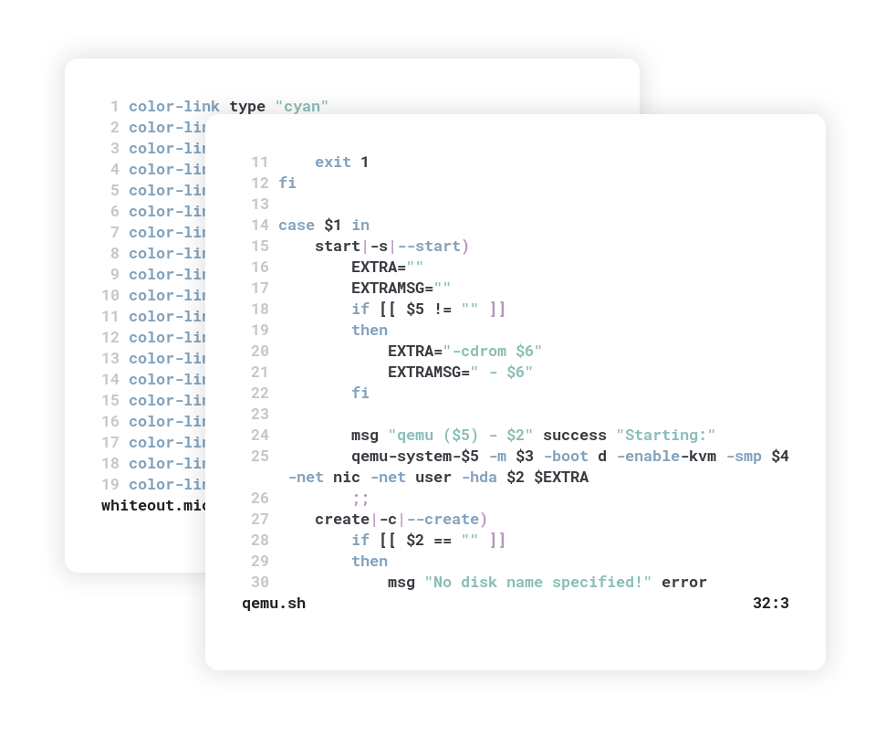

Install with: `curl https://raw.githubusercontent.com/0neGuyDev/micro-whiteout/main/install.sh | sh`

Or manually place the `.micro` colorscheme file in your colorschemes folder.

This theme is a collection and part of my overall setup. You can check out other parts of the theme [here](https://github.com/0neGuyDev/whiteout)
The colorscheme in the images are from [Tomorrow](https://github.com/ChrisKempson/Tomorrow-Theme) running on GNOME Terminal with picom as the compositor and Roboto Mono as the font.

The script on the terminal in the front is something I've been working on as a helper for qemu, I might release that as well.
